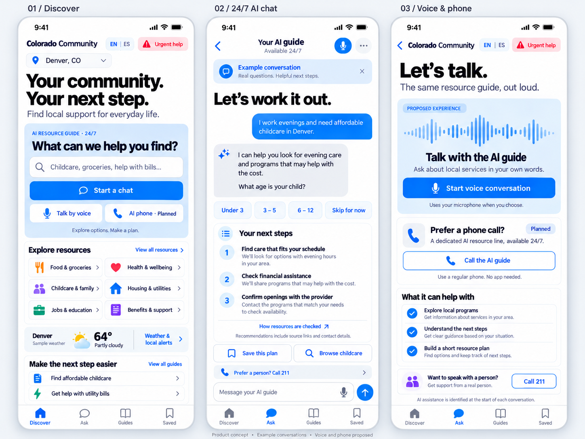

# FieldCompass

Product planning and implementation handoff for a Colorado community resource navigator.

FieldCompass is the working name. The product serves everyday community needs across food, healthcare, childcare, housing, employment, transportation, benefits, and more, with 24/7 AI chat as a planned core capability.

## Start here

1. [Product scope](docs/FieldCompass-product-scope.md) covers the vision, audiences, requirements, release phases, resource data, privacy, accessibility, operations, and launch decisions.
2. [Developer handoff](docs/FieldCompass-build-handoff.md) covers implementation order, technical contracts, work packages, and acceptance scenarios.
3. [Mobile concept](docs/colorado-community-mobile-v3.png) illustrates discovery, AI chat, and proposed voice and phone access.

## Run the app (pilot vertical slice)

Requires Node 20+.

```bash
npm install
npm run dev        # http://localhost:3000 with auto-reload
npm test           # domain + HTTP acceptance tests
npm run build && npm start   # compiled build
```

What works now: Discover, search with filters and no-match suggestions, resource detail, urgent help, English/Spanish, and on-device saved plans (save, status, notes, export, print, clear). All listings are **fictional sample data** (`src/data/fixtures`) and the app refuses to load them with `APP_ENV=production`. See [ADR 0001](docs/adr/0001-initial-architecture.md) for decisions and what's next.

```
src/domain/     search, geography, schedule rules, record types
src/data/       repository + sample fixtures (regenerate: node scripts/gen-fixtures.mjs)
src/web/        server-rendered pages and layout
src/i18n/       EN/ES interface strings (Spanish needs fluent review)
public/         CSS design tokens, plan.js (local plans), exit.js
tests/          vitest + supertest
```

## Status

This repository contains planning documents, a visual concept, and the first vertical slice of the application (not deployed). FieldCompass is a provisional name; the mockup still uses the earlier Colorado Community wordmark. The written scope takes precedence over the mockup.

The intended first release includes an accessible resource directory, grounded AI chat, reviewed guides, saved plans, weather, and official-alert access. Browser voice, a dedicated AI phone line, and optional synchronization and reminders are proposed later releases.

Data reuse permission, final branding, operating ownership, and phone-service setup must be resolved before the corresponding production work. No affiliation with 211 Colorado is implied.

## Reference concept



Documentation version: October 7, 2026.
